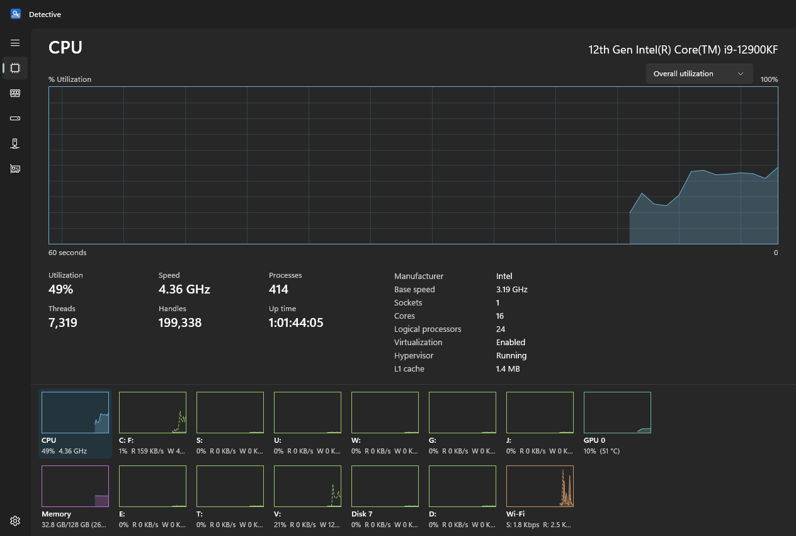
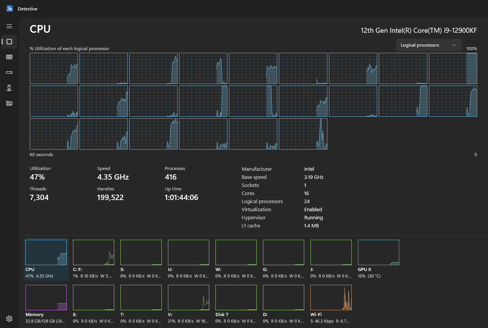
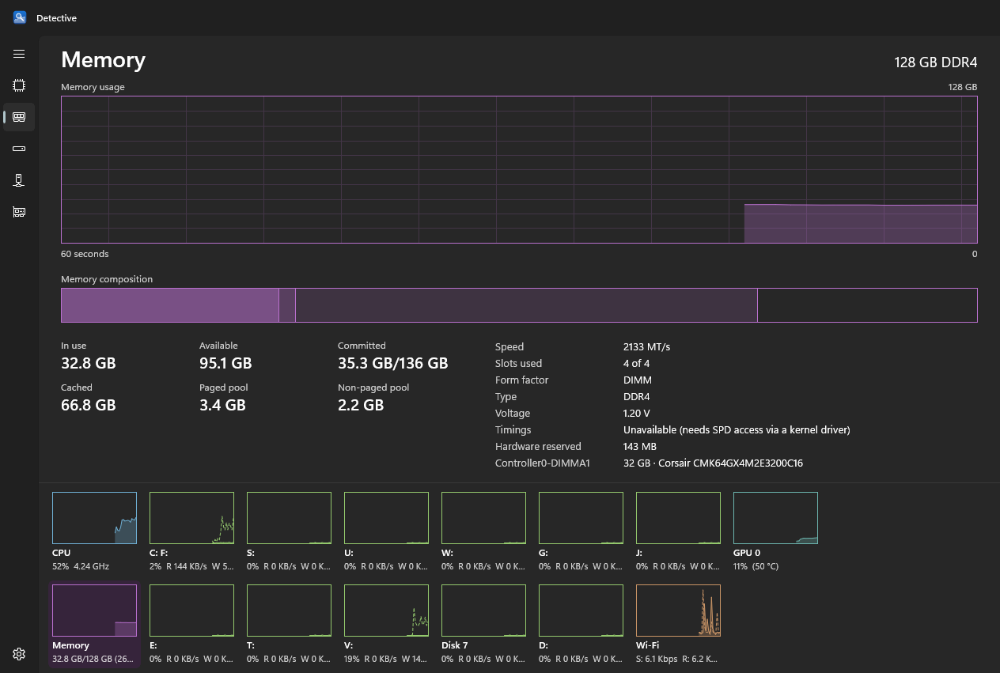
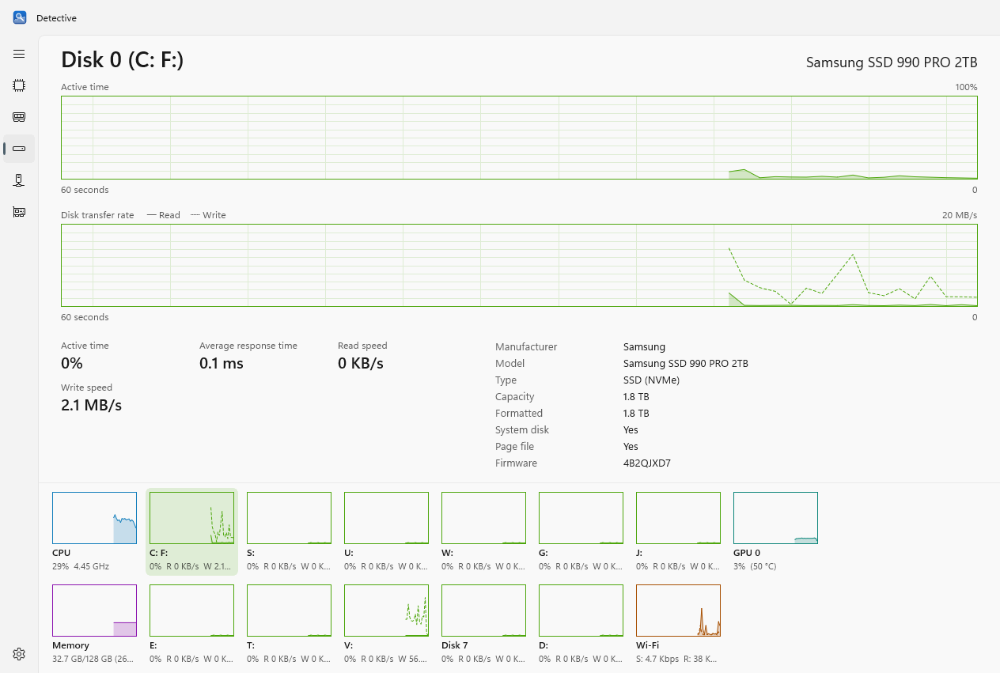
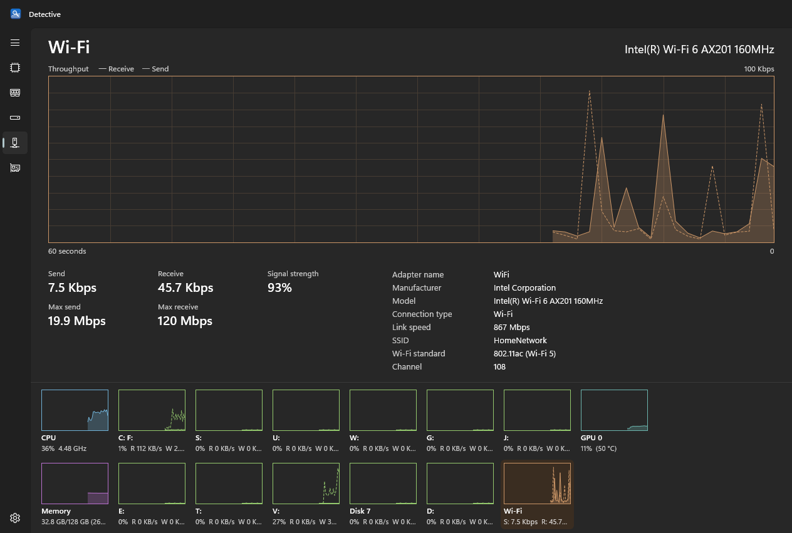
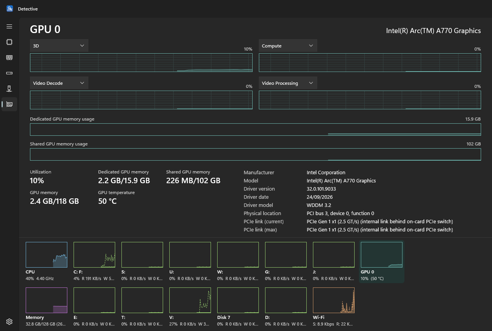
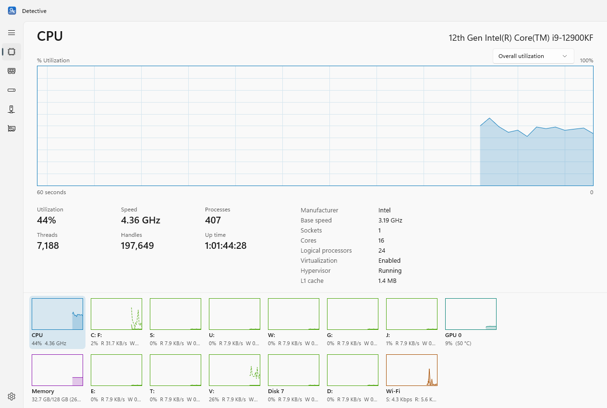

# Detective

A native Windows performance monitor, modelled on the **Performance** page of the Windows 11 Task Manager. It shows live charts and hardware details for your CPU, memory, disks, network adapters and GPUs.



## Features

- **CPU**: overall utilization or a per-logical-processor grid; speed, processes, threads, handles, up time; cores, sockets, L1/L2/L3 cache, family/model/stepping, virtualization.
- **Memory**: usage chart and a composition bar (in use, modified, standby, free); committed, cached, paged and non-paged pool; each installed module with slot, capacity, maker, part number, speed and voltage.
- **Disks**: one item per physical disk, with its volumes rolled up; active time, read and write rates, response time; model, interface (NVMe/SATA/USB), SSD or HDD, capacity, and every volume's file system and free space.
- **Networks**: physical adapters only. Send and receive throughput, with **maximum speeds remembered per adapter** (right-click to reset). Also signal strength, SSID, Wi-Fi standard, channel, IPv4/IPv6, gateway, DNS and MAC.
- **GPUs**: four engine charts, each with a picker (3D, Compute, Video Decode, Copy, …); dedicated and shared memory; temperature, driver, WDDM version and PCIe location.

The summary strip along the bottom holds a small chart for every item. Click one to open it in the main area, or use the rail on the left. The gear at the bottom of the rail sets the update speed (0.5 s, 1 s, 4 s or paused) and the theme. The last opened item, CPU chart mode and GPU engine choices are remembered between sessions.

## Screenshots

| | |
|---|---|
|  |  |
| **CPU:** one chart per logical processor | **Memory:** usage, composition and modules |
|  |  |
| **Disk** in the light theme: active time and transfer rate | **Network:** throughput and maximum speeds |
|  |  |
| **GPU:** engine charts, memory and PCIe details | **Light theme** follows Windows or can be set |

## Download

Get `Detective-win-x64.zip` from the [latest release](https://github.com/andrewrigney1975-cpu/ar-windowsperfmon/releases/latest), extract it anywhere, and run `Detective.exe`. The .NET runtime and Windows App SDK are included, so nothing else needs installing. It runs as a standard user.

**Requirements:** Windows 10 version 2004 (build 19041) or later, 64-bit x64. Built and tested on Windows 11.

- The exe isn't code-signed, so SmartScreen may warn on first run ("More info" → "Run anyway").
- **Wi-Fi SSID** needs location access on Windows 11 24H2 and later: Settings → Privacy & security → Location → "Let desktop apps access your location".
- **RAM timings** aren't shown, because reading them requires a kernel driver.
- **PCIe link on cards with an on-board PCIe switch** (such as Intel Arc) is the card's internal link, labelled as such. Windows doesn't expose the slot link for those cards.
- Settings are stored in `%LOCALAPPDATA%\Detective\settings.json`. If the app ever crashes, the details are written to `crash.log` in the same folder.

## Building

Requirements: Visual Studio 2026 with the .NET desktop and **Desktop development with C++** workloads (the C++ tools provide the Native AOT linker), and the .NET 10 SDK.

- **Debug:** open `Detective.slnx` and run the `Detective` project (x64).
- **Release:** run `.\publish.ps1`. It produces `publish\Detective\` and `publish\Detective-win-x64.zip`: a Native AOT, self-contained build with English-only resources and unused Windows App SDK components removed (about 55 MB, 35 files). The script expects MSBuild at `F:\Program Files\Microsoft Visual Studio\18\Community`; edit `$msbuild` at the top if yours is elsewhere.
- **Tests:** `dotnet test tests/Detective.Core.Tests -p:Platform=x64`

### Project layout

```
src/Detective.Core/   Data collection, no UI: PDH counters, DXGI/D3DKMT (GPU), SetupAPI (PCIe),
                      WLAN, WMI, and the background Sampler that produces one snapshot per tick
src/Detective/        WinUI 3 app: shell, views, view models, the AreaChart control, settings
tests/                Unit tests for parsers, scaling and formatting
PLAN.md               Design plan and decisions
```

### Snapshot mode

`Detective.exe --snapshot <dir>` renders every view to PNG and exits. It works while the screen is locked or the window is covered. Options:

- `--theme light|dark`: force a theme.
- `--size 1280x860`: set the window size in DIPs.
- `--redact`: replace the SSID, IP addresses, gateway, DNS and MAC with placeholder values. The screenshots above were made this way.
